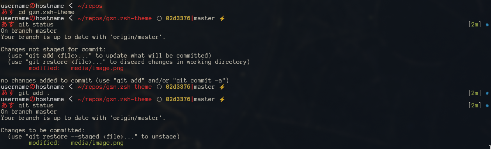

# gzn.zsh-theme

This is a fork from [daivasmara](https://github.com/Daivasmara/daivasmara.zsh-theme) theme.



* Colors: [Ayu color theme from kitty terminal emulator](https://github.com/dexpota/kitty-themes?tab=readme-ov-file#ayu).
* Font: [Anonymous Pro for Powerline Bold - 14pt](https://github.com/powerline/fonts).

**NOTE:** These are the colors and font that I'm using. You don't necessarily need to set these up, you only need to if you want the looks to be exactly like the image above.

## Installation

### Oh my zsh

Install the zsh theme [by following this guide](https://github.com/ohmyzsh/ohmyzsh/wiki/Customization#overriding-and-adding-themes).

### Kitty

Install the kitty's ayu theme, if you want by running `kitty +kitten themes`.  

If you want to install it manually, you can copy [ayu-gzn-theme.conf](./ayu-gzn-theme.conf)
next to your kitty configuration file (commonly seen at `~/.config/kitty/`) and
adding the following line:

```bash
# BEGIN_KITTY_THEME
include ayu-gzn-theme.conf
# END_KITTY_THEME
```
